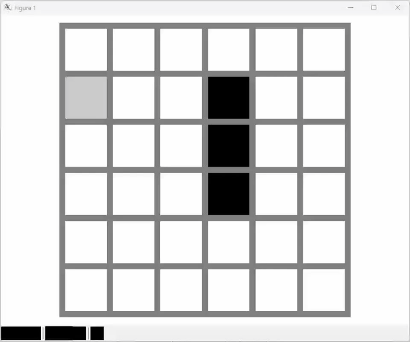
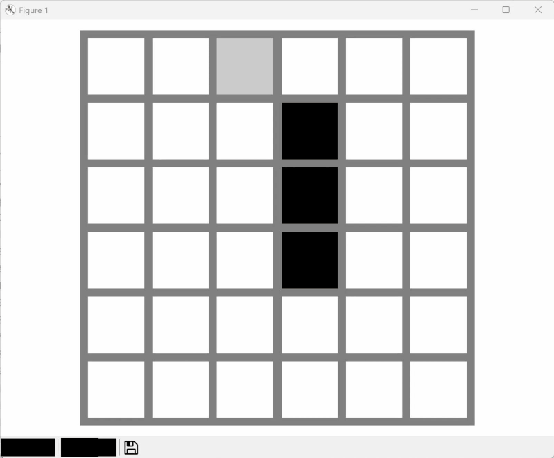
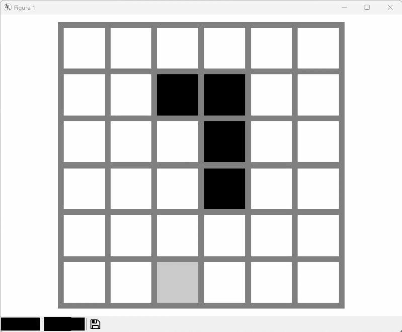
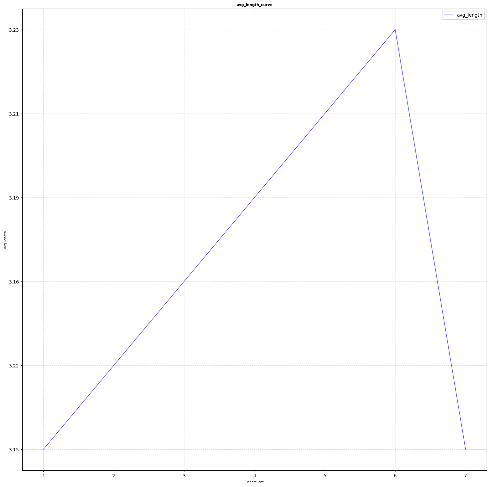
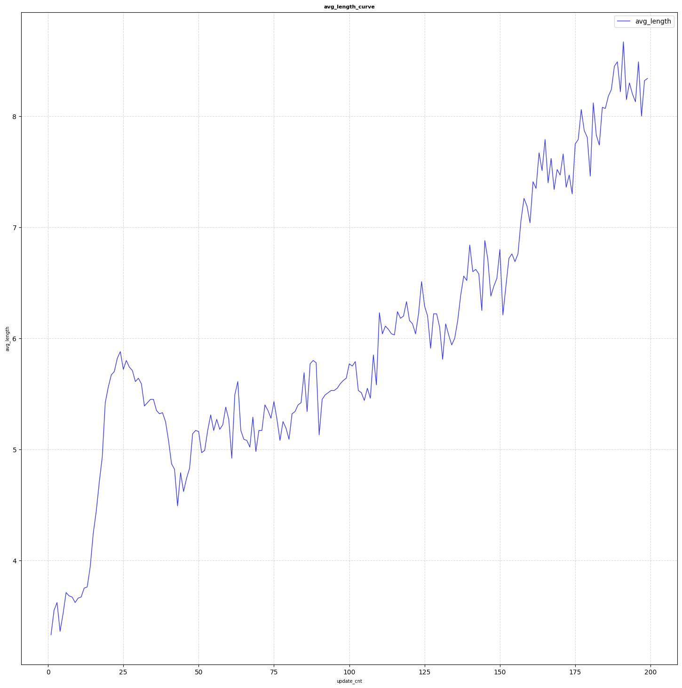
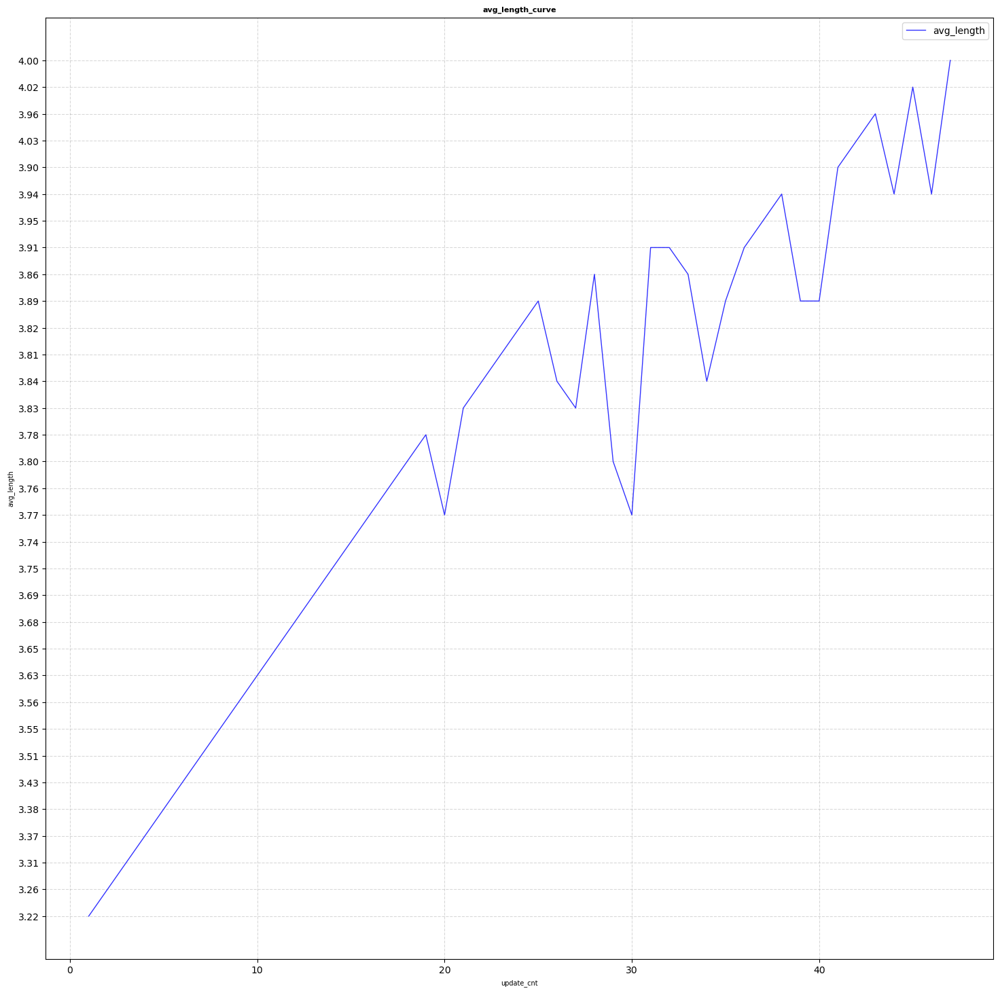
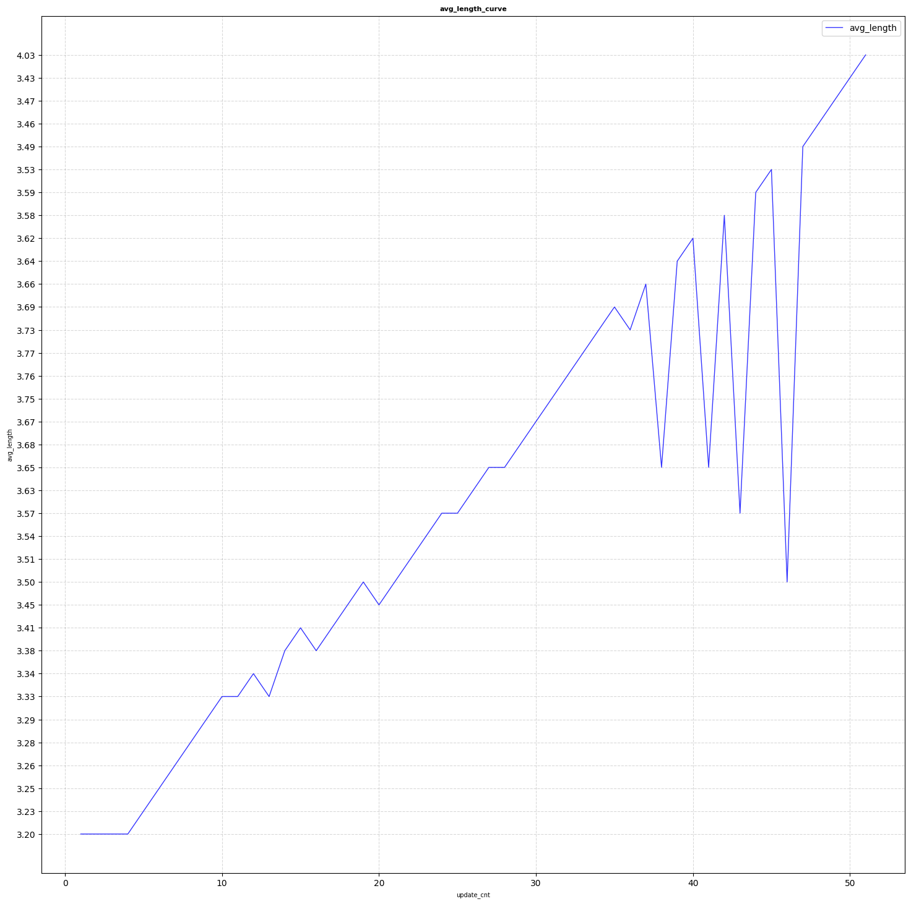
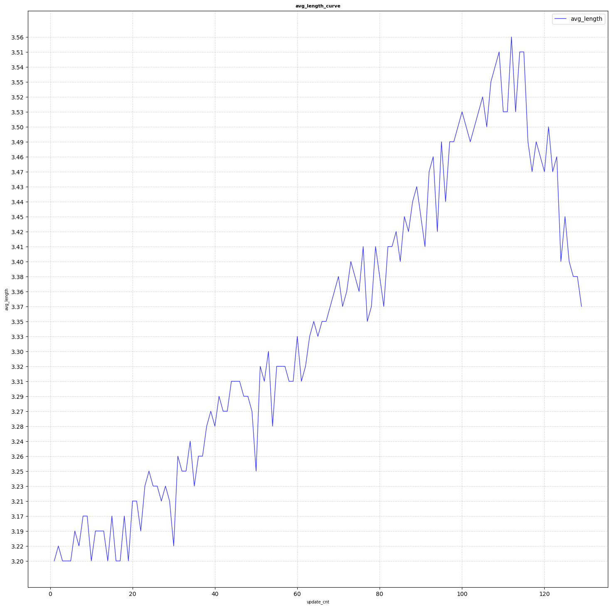
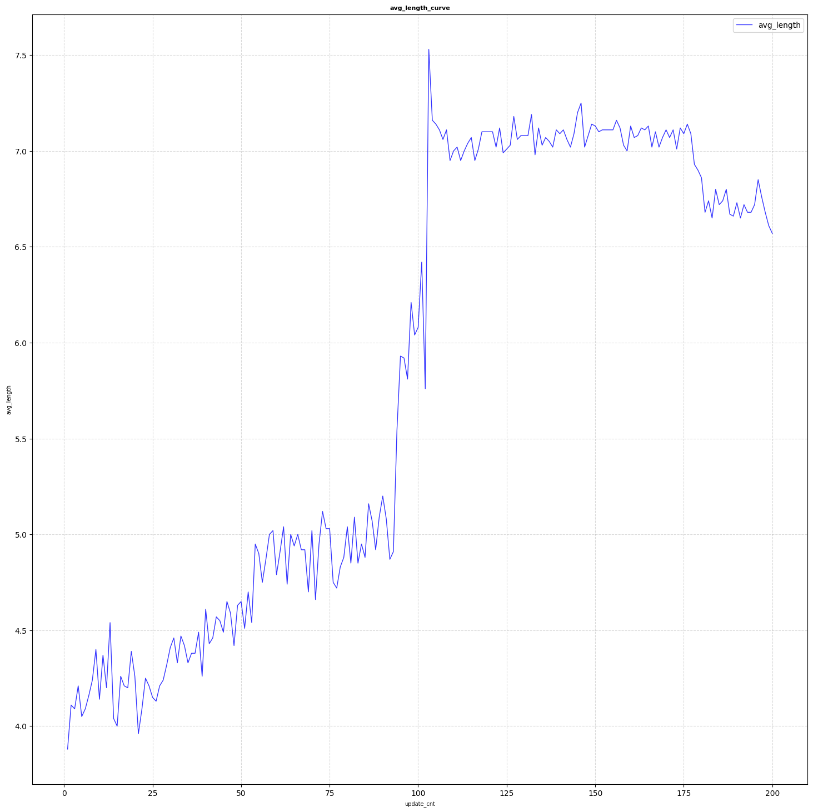

# 贪吃蛇（强化学习算法对比）

本项目旨在探究不同强化学习算法在6×6地图贪吃蛇游戏中的表现。游戏目标是通过控制蛇不断获取食物，并尽快用其身体填满整个地图。

## 实验设置

在随机种子固定为42的条件下，我们通过以下两项指标评估各算法在1000局游戏中的表现（每局限80步）：

1. **平均长度**：每局结束时蛇的平均身体长度  
2. **最大长度**：所有对局中蛇达到的最大身体长度

| 算法 | 演示 | 平均长度 | 最大长度 |
|:------:|:------:|:--------:|:--------:|
| **GRPO 算法** |  | 12.038 | 26 |
| **Double DQN 算法** |  | 12.151 | 22 |
| **PPO 算法** |  | 11.653 | 20 |

## 算法细节与调优尝试

在实验过程中，我们尝试了多种算法实现与调优策略，并观察到以下现象：

1. 对 Double DQN 进一步优化，如引入基于 TD 误差的优先经验回放，并未带来性能提升，反而导致训练效果下降。
2. 在 GRPO 中若改用单步计算优势值（而非基于完整轨迹），模型训练会迅速进入平台期，收敛性能受限。
3. 为 GRPO 引入经验回放机制反而显著降低了训练效率与最终性能。
4. 在贪吃蛇环境中，同步更新的 PPO 算法在特定奖励函数与网络结构下表现一般；改为异步更新策略网络与价值网络后，获得了更优的训练效果。

## 训练曲线对比

以下为各算法及变体在训练过程中的性能变化图示：

  <table>
    <tr>
      <td align="center">
         
        <em>Double DQN，每20局进行一次网络更新</em>
      </td>
      <td align="center">
         
        <em>Rainbow DQN，每50局进行一次网络更新</em>
      </td>
      <td align="center">
         
        <em>GRPO（完整轨迹优势估计），每20局更新一次</em>
      </td>
      <td align="center">
         
        <em>GRPO（单步优势估计），每20局更新一次</em>
      </td>
    </tr>
    <tr>
      <td align="center">
         
        <em>同步PPO，每完成一局即更新</em>
      </td>
      <td align="center">
         
        <em>同步PPO，每10局进行一次更新</em>
      </td>
      </td>
      <td align="center">
         
        <em>异步PPO，更新频率随训练阶段调整（前期20局/次，后期10局/次）</em>
      </td>
    </tr>
  </table>

---
**作者：浙江大学学生-绿意不息**

